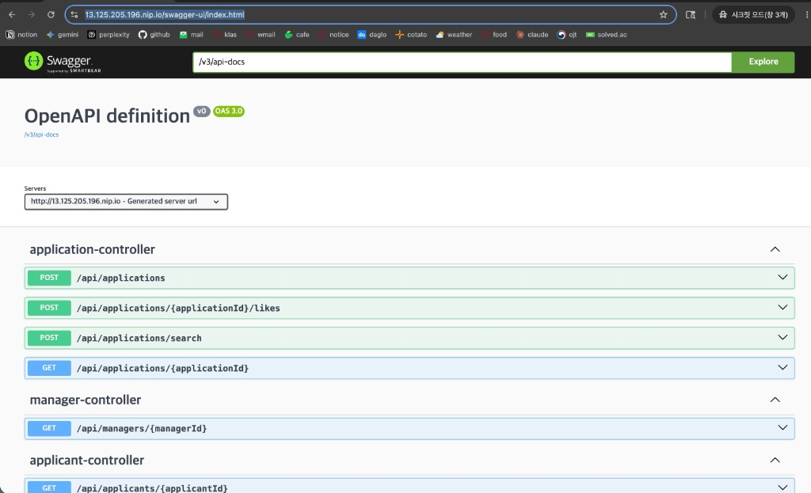
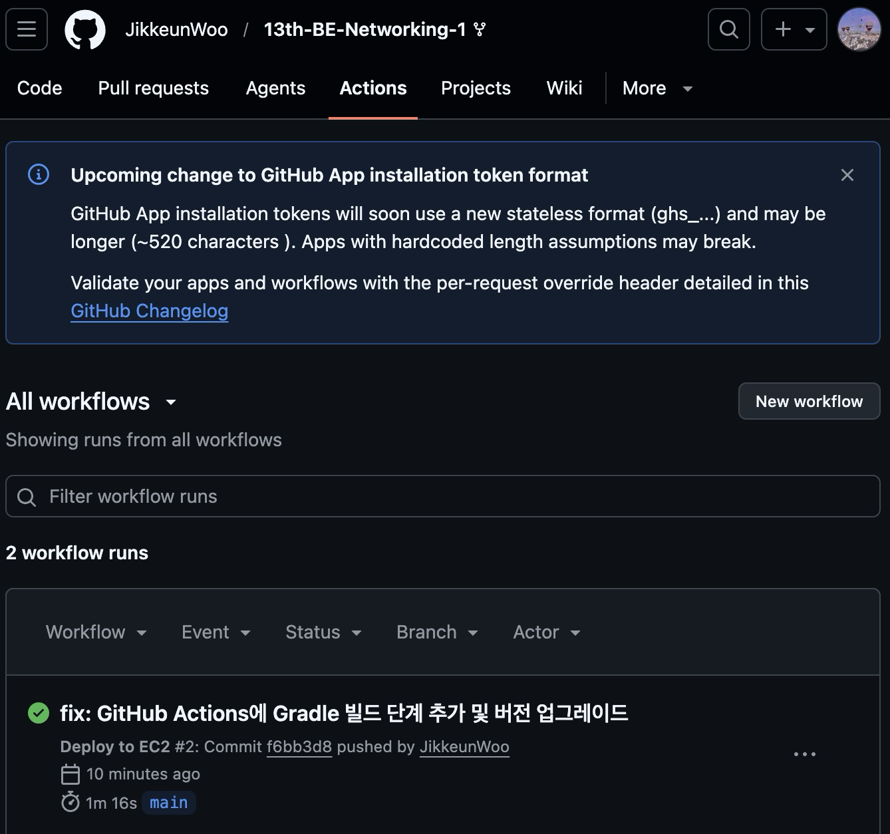

# 🚀 13기 백엔드 네트워킹 배포 과제

## 1. 아키텍처 다이어그램
사용자 ➔ [ HTTPS / .nip.io 도메인 ] ➔ EC2 (Nginx 리버스 프록시) ➔ Spring Boot 컨테이너 (8080) ➔ MySQL 컨테이너 (3306)
* **CI/CD:** GitHub Actions ➔ Docker Hub ➔ EC2 자동 배포

## 2. 배포 URL
* **기본 URL:** https://13.125.205.196.nip.io
* **Swagger URL:** https://13.125.205.196.nip.io/swagger-ui/index.html

## 3. 배포된 Swagger 접속 화면

## 4. GitHub Actions 성공 화면

## 5. Dockerfile / Nginx 설정 내용
**[Dockerfile]**
```dockerfile
FROM eclipse-temurin:17-jdk-alpine
ARG JAR_FILE=build/libs/*.jar
COPY ${JAR_FILE} app.jar
ENTRYPOINT ["java", "-Dspring.profiles.active=prod", "-jar", "/app.jar"]
[Nginx 설정 (cotato.conf)]
server {
    listen 80;
    server_name 13.125.205.196.nip.io;

    location / {
        proxy_pass [http://127.0.0.1:8080](http://127.0.0.1:8080);
        proxy_set_header Host $host;
        proxy_set_header X-Real-IP $remote_addr;
        proxy_set_header X-Forwarded-For $proxy_add_x_forwarded_for;
        proxy_set_header X-Forwarded-Proto $scheme;
    }
}

6. 트러블슈팅 노트 (Troubleshooting)
문제 1: 로컬에서 빌드한 도커 이미지가 EC2에서 실행되지 않거나 오류 발생

원인: 로컬 환경(Apple Silicon M1, ARM64)과 배포 환경(EC2 t3.micro, AMD64)의 아키텍처가 달라 호환성 문제가 발생함.

해결: docker build --platform linux/amd64 -t ... 명령어를 사용하여 빌드 시 타겟 플랫폼을 명시적으로 EC2 환경에 맞춤으로써 해결함.

문제 2: EC2에서 Nginx 설치 시 터미널이 멈추는 현상 발생

원인: 프리티어(t3.micro)의 기본 RAM(1GB) 용량이 부족하여, 여러 컨테이너가 띄워진 상태에서 패키지 설치 시 OOM(Out Of Memory)이 발생함.

해결: EC2 인스턴스 재부팅 후, dd 명령어로 2GB의 Swap 메모리(가상 메모리)를 할당하여 서버 늘린 뒤 무사히 설치 완료함.

문제 3: 터미널에서 GitHub 푸시 시 Authentication failed 에러 발생

원인: 깃허브 정책상 비밀번호를 통한 직접 푸시가 금지됨.

해결: Developer Settings에서 repo와 workflow 권한이 부여된 Personal Access Token(PAT)을 발급받아 원격 저장소 URL에 적용하여 푸시 성공.

